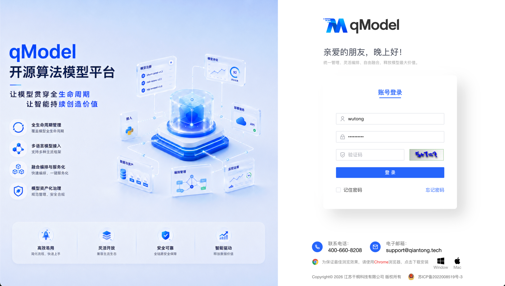
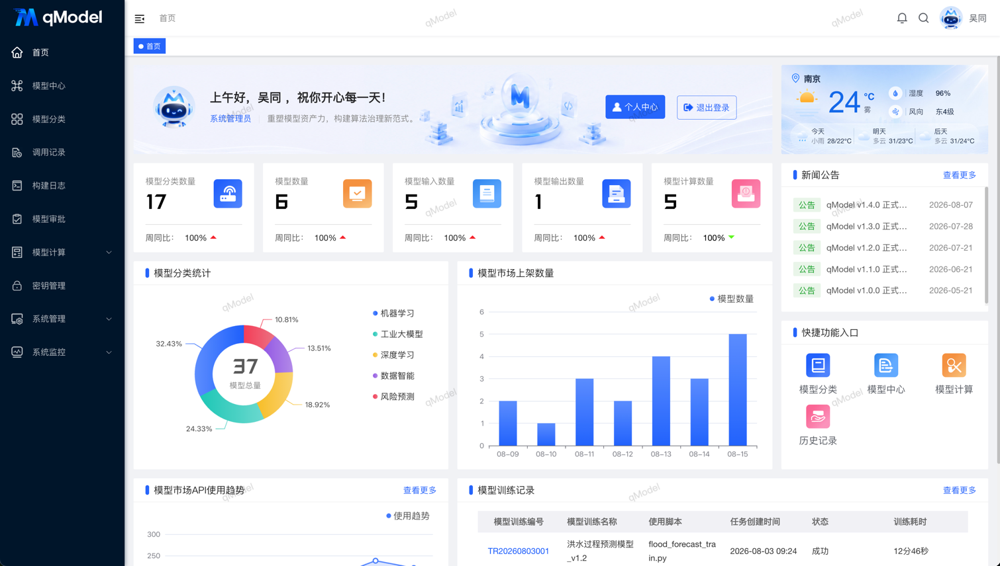
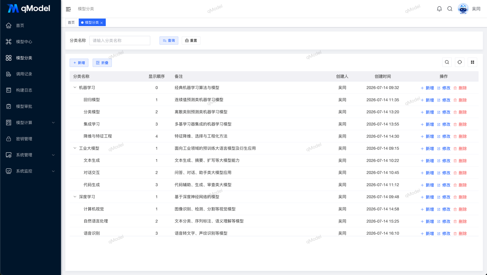
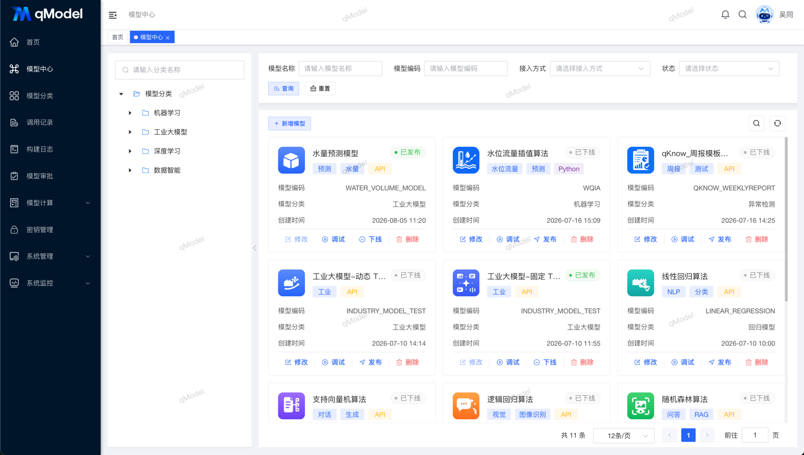
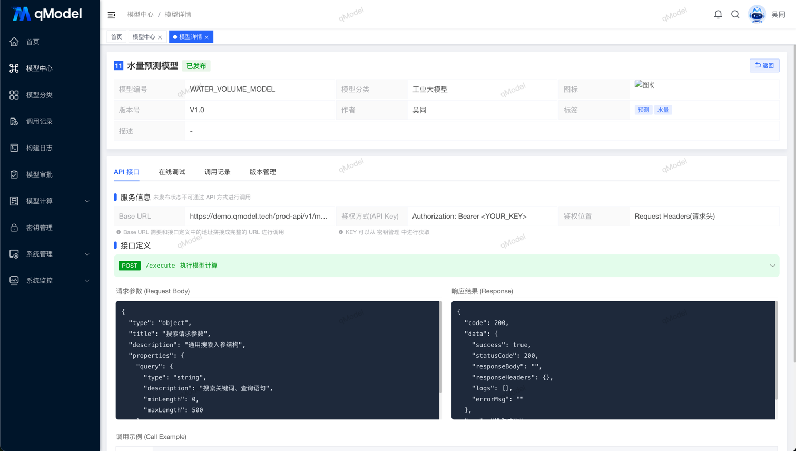
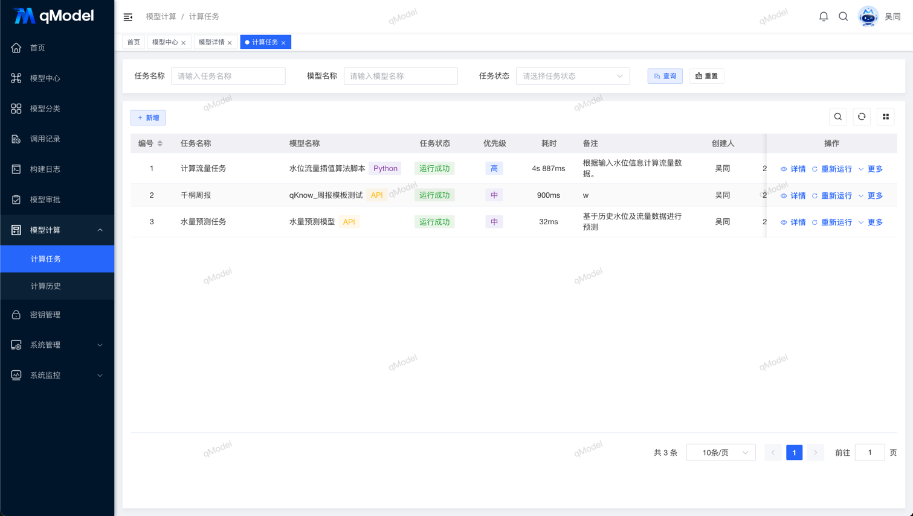
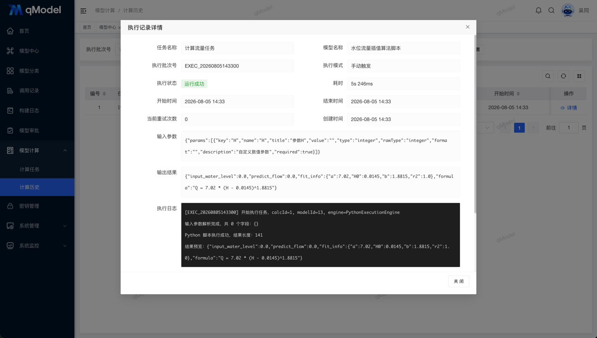
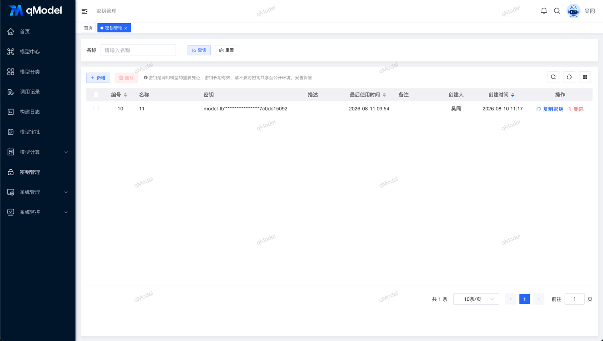

 

 
 
 
 
 
 
 

  📖English | <a href="README.md">📖简体中文</a>

## 🌈 Platform Overview

Large models are hot, but what truly drives business落地 is often small models. qModel, the open-source algorithm platform, is built to solve enterprises' "small model chaos." The competition of the future is not just about data — it's about model assets. Those who can turn algorithms into **manageable, iterable, reusable, and tradable** services will seize the initiative in intelligence.

**qModel** is an open-source algorithm platform centered on **full lifecycle model management**, providing capabilities for industry algorithm model integration, registration, testing, deployment, computation, fusion, orchestration, and servitization. It helps enterprises and research institutions transform algorithm assets into operable, reusable, and governable intelligent services.  
The platform supports multiple model formats including Python, Java, and exe, bridging the engineering pipeline from experiment to production, and providing a solid foundation for collaborative application of traditional algorithms.

✨✨✨**Online Documentation**✨✨✨ <a href="https://community.qmodel.tech" target="_blank">https://community.qmodel.tech</a>

✨✨✨**Demo Address**✨✨✨ <a href="https://demo.qmodel.tech" target="_blank">https://demo.qmodel.tech</a> (Account: `qModel`, Password: `qModel123`)

> **qModel Model Management Platform — Empowering models across their full lifecycle, continuously creating intelligent value.**

## 🍱 Typical Application Scenarios

| Scenario | Description |
|----------------|-------------|
| **AI Model Asset Management** | Centrally manage models scattered across teams, enabling version control, classification tags, and permission governance |
| **Research Achievement Engineering** | Quickly encapsulate algorithms from the lab into callable services, accelerating成果转化 |
| **Multi-Model Fusion Inference** | Support weighted fusion, voting, Stacking, and other strategies to improve prediction robustness |
| **Intelligent Workflow Orchestration** | Visually drag-and-drop to build AI workflows containing multiple models, supporting complex business logic |
| **Private Model Marketplace** | Build enterprise-internal model sharing and trading mechanisms, promoting knowledge reuse and innovative collaboration |

## 🚀 Core Advantages

- **Full lifecycle coverage**: From upload, testing, and release to monitoring and decommissioning — fully traceable
- **Multi-language compatibility**: Supports Python scripts, Java JARs, executable programs, and other model formats
- **Lightweight architecture**: Ready to use out of the box, supports one-click Docker deployment
- **Modular design**: Core functions are decoupled, facilitating secondary development and integration
- **Born open-source**: Community-driven, continuously evolving

## ✨ Core Features

| Feature Module | Description | Open Source |
|-------------|-------------|-----------|
| **System Management** | Unified governance of users, roles, departments, menus, dictionaries, parameters, announcements, logs | ✅ Done |
| **Model Classification** | Create and manage model classification systems, including classification hierarchy and tag grouping | ✅ Done |
| **Model Management** | Register, classify, tag, approve, publish/decommission, version control | ✅ Done |
| **Model Computation** | Task management, parameter configuration, result visualization, download; open-source version requires manual input data binding | ✅ Done |
| **Computation History** | View historical computation task records, filter by model, time, status, and trace results | ✅ Done |
| **Model Integration & Runtime** | Support multi-language model upload, auto-parsing, compatibility detection; open-source supports Python/Java/exe | ⏳ Planned |
| **Model Packaging** | Provide standardized packaging specifications; documentation guidance provided | ⏳ Planned |
| **Service Governance & Scheduling** | Auto-generate RESTful API; support authentication, rate limiting, concurrency control, call chain monitoring, watermarking, etc. | ⏳ Planned |
| **Comprehensive Management** | Development documentation management | ⏳ Planned |

> Note: Advanced features such as automated containerization, online debugging, fusion orchestration, and training loops will be available in the commercial edition. Community contributions to the open-source version are welcome!

## 🛠️ Tech Stack

qModel adopts a front-back separated architecture. The backend is based on Spring Boot, the frontend on Vue 3, integrating mainstream middleware to build an enterprise-grade model management solution.

<table>
  <tr>
    <th>Tech Stack</th><th>Framework</th><th>Description</th>
  </tr>
  <tr>
    <td rowspan="6">Backend</td><td>Spring Boot</td><td>Core framework, simplifying configuration and development</td>
  </tr>
  <tr>
    <td>MyBatis-Plus</td><td>ORM framework, simplifying database operations</td>
  </tr>
  <tr>
    <td>Spring Security</td><td>Authentication, authorization, and security control</td>
  </tr>
  <tr>
    <td>Quartz</td><td>Task scheduling (for computation tasks)</td>
  </tr>
  <tr>
    <td>Alibaba Druid</td><td>High-performance database connection pool</td>
  </tr>
  <tr>
    <td>Swagger</td><td>Auto-generate API documentation</td>
  </tr>

  <tr>
    <td rowspan="7">Frontend</td><td>Vue 3</td><td>Reactive frontend framework</td>
  </tr>
  <tr>
    <td>Vite</td><td>Ultra-fast build tool</td>
  </tr>
  <tr>
    <td>Element Plus</td><td>Modern UI component library</td>
  </tr>
  <tr>
    <td>Pinia</td><td>Lightweight state management</td>
  </tr>
  <tr>
    <td>Vue Router</td><td>Frontend routing management</td>
  </tr>
  <tr>
    <td>Axios</td><td>HTTP request encapsulation</td>
  </tr>
  <tr>
    <td>ECharts</td><td>Computation result and resource monitoring visualization</td>
  </tr>

  <tr>
    <td rowspan="5">Third-party Dependencies</td><td>MySQL</td><td>Model metadata storage</td>
  </tr>
  <tr>
    <td>Redis</td><td>Task queue and caching</td>
  </tr>
  <tr>
    <td>Docker (optional)</td><td>Containerized deployment support (commercial edition auto-builds images)</td>
  </tr>
  <tr>
    <td>Local Storage</td><td>Model files and computation result storage</td>
  </tr>
</table>

## 🏗️ Deployment Requirements

Before deploying qModel, please ensure the following environment is ready:

<table>
  <tr>
    <th>Environment</th><th>Item</th><th>Recommended Version</th><th>Description</th>
  </tr>
  <tr>
    <td rowspan="5">Backend</td><td>JDK</td><td>1.8+</td><td>Runtime environment</td>
  </tr>
  <tr>
    <td>Maven</td><td>3.6+</td><td>Project build</td>
  </tr>
  <tr>
    <td>MySQL</td><td>5.7 / 8.0</td><td>Metadata database</td>
  </tr>
  <tr>
    <td>Redis</td><td>5.0+</td><td>Task queue and caching</td>
  </tr>
  <tr>
    <td>OS</td><td>Linux / Windows / macOS</td><td>Universal support</td>
  </tr>

  <tr>
    <td rowspan="3">Frontend</td><td>Node.js</td><td>16+</td><td>Build dependency</td>
  </tr>
  <tr>
    <td>pnpm / npm</td><td>Latest</td><td>Package manager</td>
  </tr>
  <tr>
    <td>Vite</td><td>≥4.0</td><td>Build tool</td>
  </tr>
</table>

## 🚨 Commercial License

qModel offers a dual-track model: **Open Source** and **Commercial**:
- The **Open Source edition** is suitable for learning, evaluation, and lightweight production, governed by the Apache 2.0 license (commercial use allowed, retain the Logo);
- The **Commercial edition** targets enterprise and government customers, providing advanced capabilities such as **automated containerization, model fusion, workflow orchestration, training loops, and model marketplace**, along with dedicated technical support and private repository access.

👉 For **brand customization licensing** or to **request a commercial edition trial**, please join the QQ group for consultation.

## 🚀 Quick Start

👉 <a href="./QUICKSTART.md">View Quick Deployment Guide</a>

## 👥 QQ Group

Welcome to join the official qModel QQ group to get the latest updates, technical support, and usage experience sharing!

## 🖼️ System Screenshots
<table>
    <tr>
        <td></td>
        <td></td>
    </tr>
    <tr>
        <td></td>
        <td></td>
    </tr>
    <tr>
        <td></td>
        <td></td>
    </tr>
    <tr>
        <td></td>
        <td></td>
    </tr>
</table>
