

 
 
 
 
 
 
 

  <a href="README.md">📖简体中文</a> | 📖English

## 🌈 Platform Overview

Large language models are all the rage, but what actually drives real business value is often the small models. The qModel algorithm model platform was built specifically to solve the "small-model chaos" problem enterprises face. Future competition is not only about data, but also about model assets — whoever can turn algorithms into **manageable, iterable, reusable, and tradable** services will take the initiative in intelligence.

**qModel** is an algorithmic model platform centered on **full-lifecycle model management**. It provides capabilities for industry algorithm model onboarding, registration, testing, deployment, computation, fusion, orchestration, and service-ization, helping enterprises and research institutions turn algorithm assets into operable, reusable, governable intelligent services.
The platform supports multi-language model formats such as Python, Java, and exe, connecting the engineering pipeline from experiment to production and providing a solid foundation for the collaborative application of traditional algorithms.

✨✨✨**Online Documentation**✨✨✨ <a href="https://community.qmodel.tech" target="_blank">https://community.qmodel.tech</a>

✨✨✨**Open-Source Edition Demo**✨✨✨ <a href="https://demo.qmodel.tech" target="_blank">https://demo.qmodel.tech</a> (Account: `qModel`, Password: `qModel123`)

✨✨✨**Professional Edition Demo**✨✨✨ <a href="https://pro-demo.qmodel.tech" target="_blank">https://pro-demo.qmodel.tech</a> For demo credentials, please [contact customer service](https://community.qmodel.tech/business/policy.html)

> **qModel Model Management Platform — keep models alive across their full lifecycle, and let intelligence keep creating value.**

## 🍱 Typical Use Cases

| Scenario          | Description                          |
|-------------|-----------------------------|
| **Model Asset Management** | Centrally manage models scattered across teams, with version control, categorization tags, and permission governance |
| **Engineering Research Outcomes** | Quickly package lab algorithms into callable services to accelerate the translation of results |
| **Multi-Model Fusion Inference** | Supports weighted fusion, voting, Stacking and other strategies to improve prediction robustness |
| **Intelligent Workflow Orchestration** | Visually drag-and-drop to build workflows containing multiple models, supporting complex business logic |
| **Private Model Marketplace** | Build an internal model sharing and trading mechanism to foster knowledge reuse and innovative collaboration |

## 🚀 Core Advantages

- Covers the **full model lifecycle**: from upload, testing, and release to monitoring and decommissioning — fully traceable
- **Multi-language compatibility**, supporting Python scripts, Java JARs, executable programs and more
- **Lightweight architecture**, out of the box, with one-click Docker deployment
- **Modular design**, with decoupled core functions for easy secondary development and integration
- **Open source from day one**, community co-built and continuously evolving

## ✨ Core Features

| Feature Module        | Description                                      | Open-Source Edition   |
|-------------|-----------------------------------------|-------|
| **System Management**    | Unified governance of users, roles, departments, menus, dictionaries, parameters, announcements, logs, etc.            | ✅ Done |
| **Model Center**    | Registration, categorization, tags, approval, publish/unpublish, version control                  | ✅ Done |
| **Model Categories**    | Create and manage model classification systems, including category hierarchy and tag groups              | ✅ Done |
| **Invocation Records**    | View detailed model invocation information, including input parameters, output results, invocation time, etc.         | ✅ Done     |
| **Build Logs**    | Detailed build information for PYTHON-type models, recording build status, build logs, etc.       |   ✅ Done    |
| **Model Approval**    | Models require approval before release to ensure model quality                    |   ✅ Done    |
| **Model Computation**    | Task management, parameter configuration, result visualization, download; open-source edition requires manual binding of input data         | ✅ Done |
| **Computation History**    | View historical computation task records, with filtering by model, time, status, etc., and result backtracking        | ✅ Done |
| **Key Management**    | When models are called by third parties, keys can be added and managed with one click to ensure model security        |   ✅ Done    |
| **Model Packaging**    | Provide standardized packaging specifications; provide documentation guidance                        | ⏳ Planned |
| **Service Governance & Scheduling** | Auto-generate RESTful APIs; supports authentication, rate limiting, concurrency control, call-chain monitoring, watermarking, etc. | ⏳ Planned |
| **Integrated Management**    | Developer documentation management                                  | ⏳ Planned |
| **Model Marketplace**    | Build an internal model sharing and trading mechanism to foster knowledge reuse and innovative collaboration              | ⏳ Planned |

> ✅ Included  🟡 Partially included  ❌ Not included (provided in the Professional Edition)

> Note: Advanced features such as automated containerization, online debugging, fusion orchestration, and closed-loop training will be provided in the Professional Edition. Community contributions to the open-source edition are welcome!

## 🛠️ Technology Stack

qModel adopts a front-end and back-end separation architecture, with the back-end based on Spring Boot and the front-end based on Vue 3, integrating mainstream middleware to build an enterprise-grade model management solution.

<table>
  <tr>
    <th>Layer</th><th>Framework</th><th>Description</th>
  </tr>
  <tr>
    <td rowspan="6">Back-end</td><td>Spring Boot</td><td>Core framework, simplifies configuration and development</td>
  </tr>
  <tr>
    <td>MyBatis-Plus</td><td>ORM framework, simplifies database operations</td>
  </tr>
  <tr>
    <td>Spring Security</td><td>Authentication, authorization and security control</td>
  </tr>
  <tr>
    <td>Quartz</td><td>Scheduled task scheduling (used for computation tasks)</td>
  </tr>
  <tr>
    <td>Alibaba Druid</td><td>High-performance database connection pool</td>
  </tr>
  <tr>
    <td>Swagger</td><td>Auto-generate API documentation</td>
  </tr>

  <tr>
    <td rowspan="7">Front-end</td><td>Vue 3</td><td>Reactive front-end framework</td>
  </tr>
  <tr>
    <td>Vite</td><td>Extremely fast build tool</td>
  </tr>
  <tr>
    <td>Element Plus</td><td>Modern UI component library</td>
  </tr>
  <tr>
    <td>Pinia</td><td>Lightweight state management</td>
  </tr>
  <tr>
    <td>Vue Router</td><td>Front-end routing management</td>
  </tr>
  <tr>
    <td>Axios</td><td>HTTP request wrapper</td>
  </tr>
  <tr>
    <td>ECharts</td><td>Visualization of computation results and resource monitoring</td>
  </tr>

  <tr>
    <td rowspan="5">Third-Party Dependencies</td><td>MySQL</td><td>Model metadata storage</td>
  </tr>
  <tr>
    <td>Redis</td><td>Task queue and cache</td>
  </tr>
  <tr>
    <td>Docker (optional)</td><td>Containerized deployment support (Professional Edition builds images automatically)</td>
  </tr>
  <tr>
    <td>Local Storage</td><td>Storage of model files and computation results</td>
  </tr>
</table>

## 🏗️ Deployment Requirements

Before deploying qModel, please make sure the following environment is ready:

<table>
  <tr>
    <th>Layer</th><th>Item</th><th>Recommended Version</th><th>Description</th>
  </tr>
  <tr>
    <td rowspan="5">Back-end</td><td>JDK</td><td>1.8+</td><td>Runtime environment</td>
  </tr>
  <tr>
    <td>Maven</td><td>3.6+</td><td>Project build</td>
  </tr>
  <tr>
    <td>MySQL</td><td>5.7 / 8.0</td><td>Metadata database</td>
  </tr>
  <tr>
    <td>Redis</td><td>5.0+</td><td>Task queue and cache</td>
  </tr>
  <tr>
    <td>Operating System</td><td>Linux / Windows / macOS</td><td>General support</td>
  </tr>

  <tr>
    <td rowspan="3">Front-end</td><td>Node.js</td><td>16+</td><td>Build dependency</td>
  </tr>
  <tr>
    <td>pnpm / npm</td><td>Latest</td><td>Package manager</td>
  </tr>
  <tr>
    <td>Vite</td><td>≥4.0</td><td>Build tool</td>
  </tr>
</table>

## 🚨 Commercial Licensing

qModel offers a dual-track model: **Open-Source Edition** and **Professional Edition**:
- **Open-Source Edition** is suitable for learning, evaluation, and lightweight production, following the Apache 2.0 license (commercial use allowed, with logo retained);
- **Professional Edition** is aimed at enterprise and government customers, providing advanced capabilities such as **automated containerization, model fusion, workflow orchestration, closed-loop training, and model marketplace**, along with dedicated technical support and private repository access.

👉 For **open-source brand customization licensing** or to **inquire about the Professional Edition**, click the button for details: [💼 Learn about licensing](https://community.qmodel.tech/business/policy.html)

## 🚀 Quick Start

| Deployment Method                                                                                        | Description                                                                       | Use Case                   |
|---------------------------------------------------------------------------------------------|--------------------------------------------------------------------------|------------------------|
| [Docker Compose Deployment](https://community.qmodel.tech/docs/deploy/docker-compose-deployment.html) | All components (MySQL, Nginx, Redis, etc.) and the qModel source code are started with one click via Docker Compose | **Quick start for beginners**, feature demo, testing environments  |
| [Self-Hosted (Manual Installation)](https://community.qmodel.tech/docs/deploy/manual-deployment/system.html)                   | All dependency components and the qModel service need to be manually installed and configured                                                | **Production environments**, large-scale deployment, customized scenarios |

> For first-time users, Docker Compose deployment is recommended to get the environment up and running and validate features faster.

## 👥 QQ Discussion Group

Welcome to join the official qModel QQ group for the latest news, technical Q&A, and usage experience sharing!

👉 [Click to join the QQ group](https://community.qmodel.tech/discuss.html)

## 🖼️ System Screenshots
<table>
    <tr>
        <td>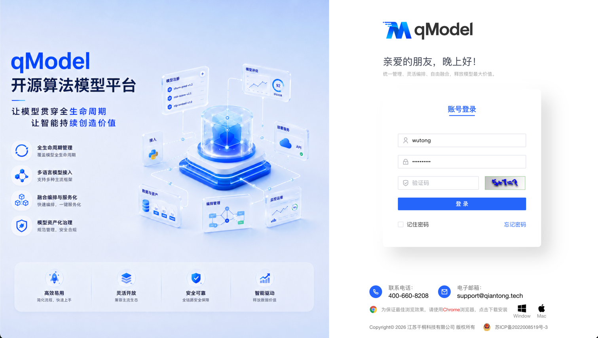</td>
        <td>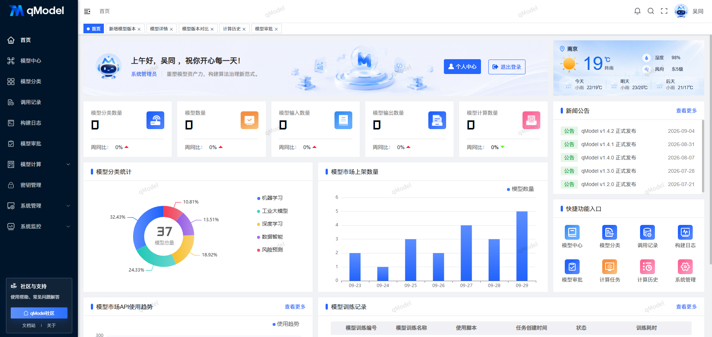</td>
    </tr>
    <tr>
        <td>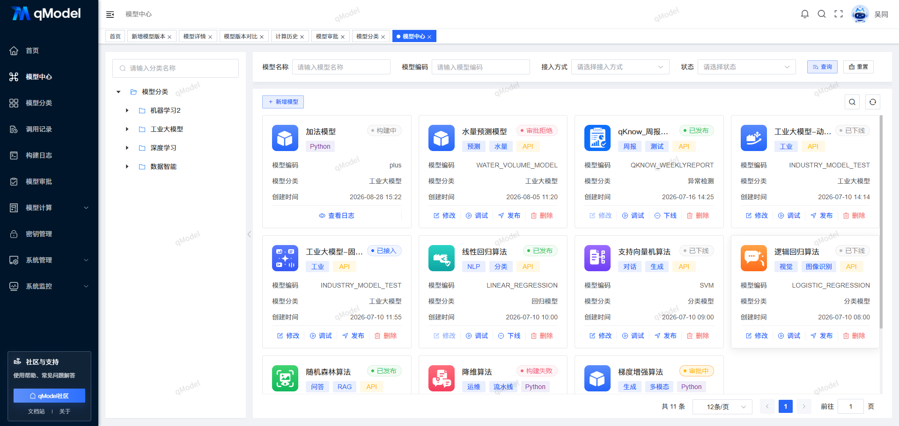</td>
        <td>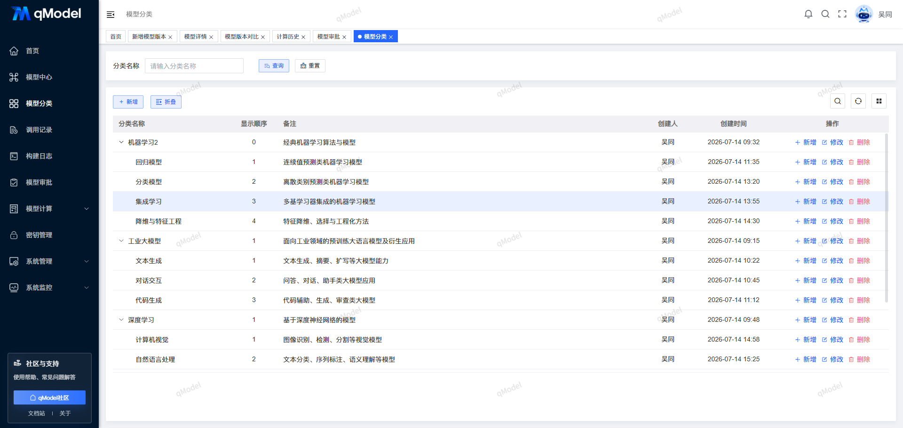</td>
    </tr>
    <tr>
        <td>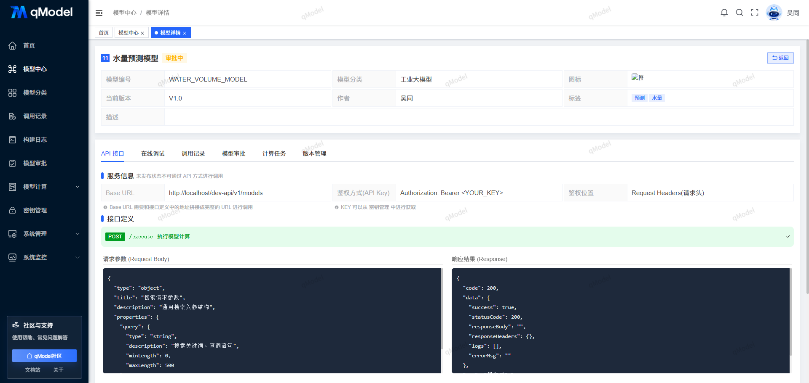</td>
        <td>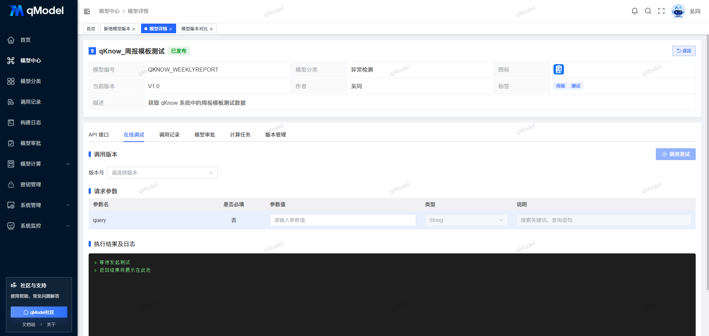</td>
    </tr>
    <tr>
        <td>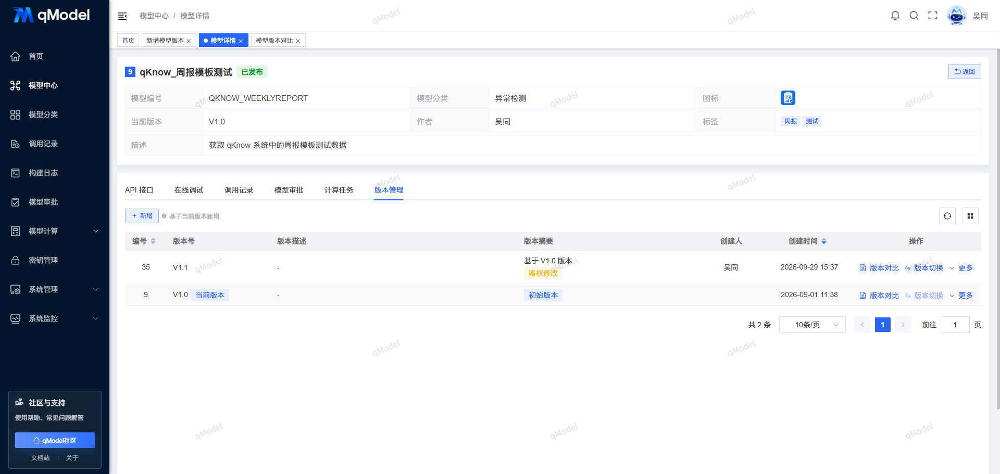</td>
        <td>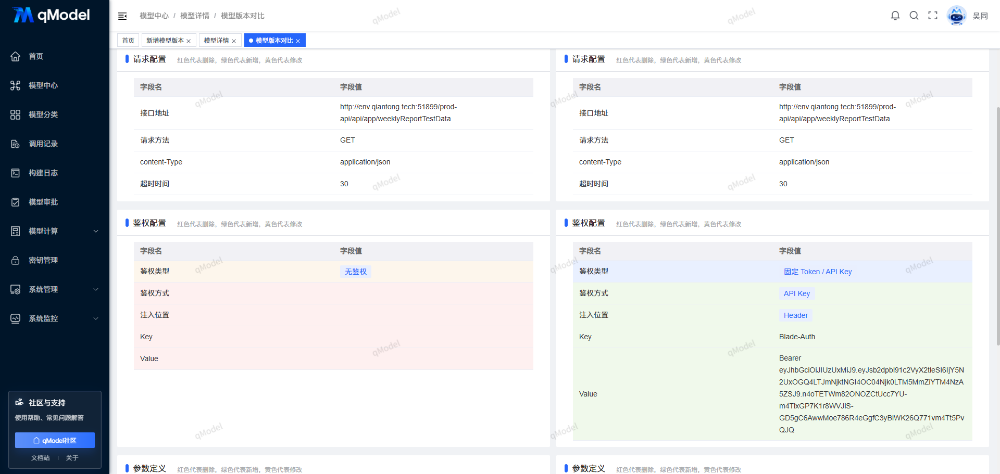</td>
    </tr>
    <tr>
        <td>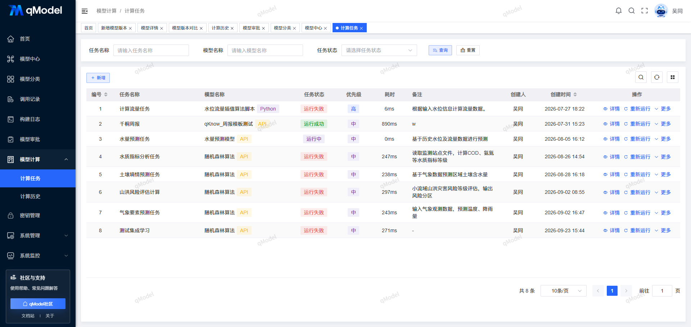</td>
        <td>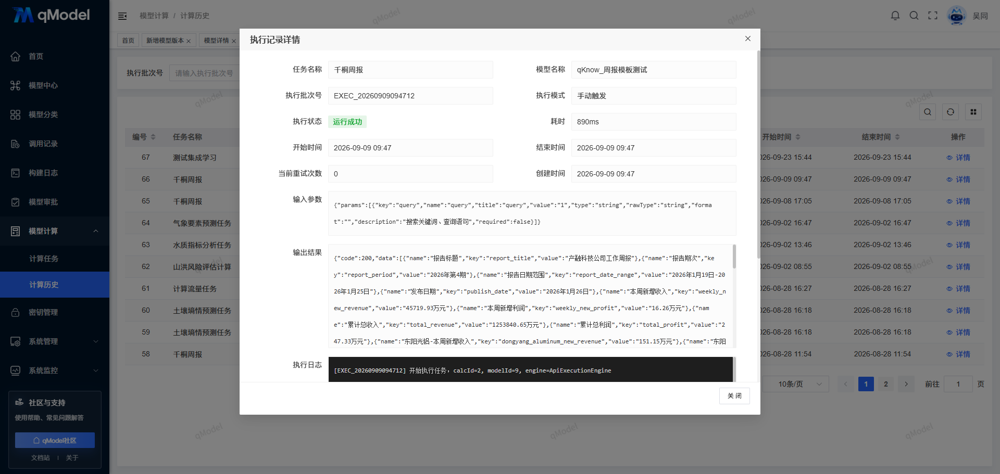</td>
    </tr>
    <tr>
        <td>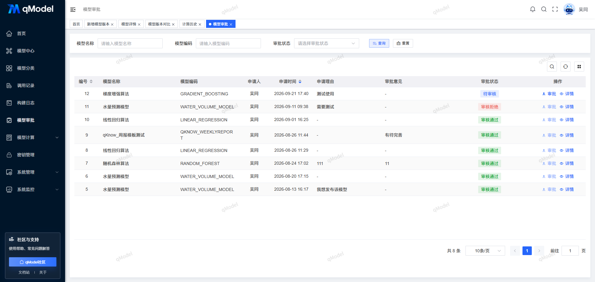</td>
        <td>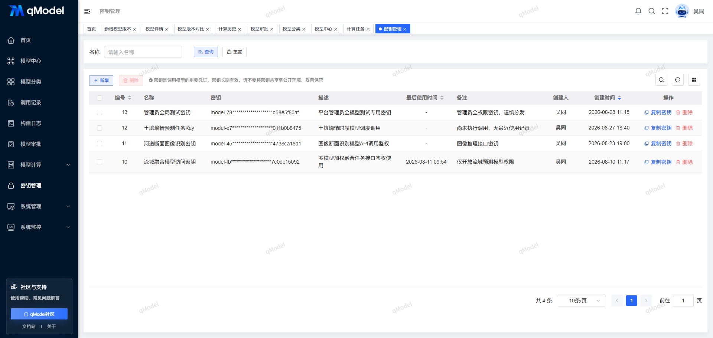</td>
    </tr>
</table>
