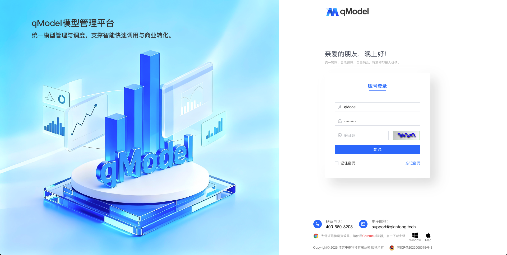
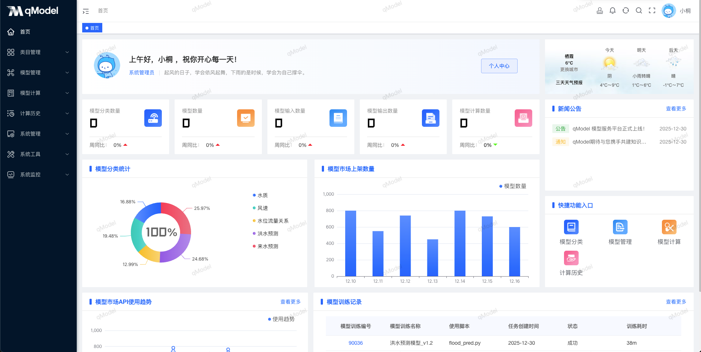
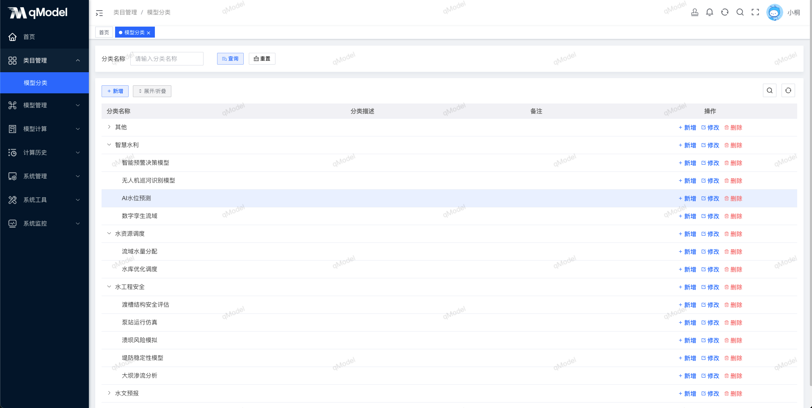
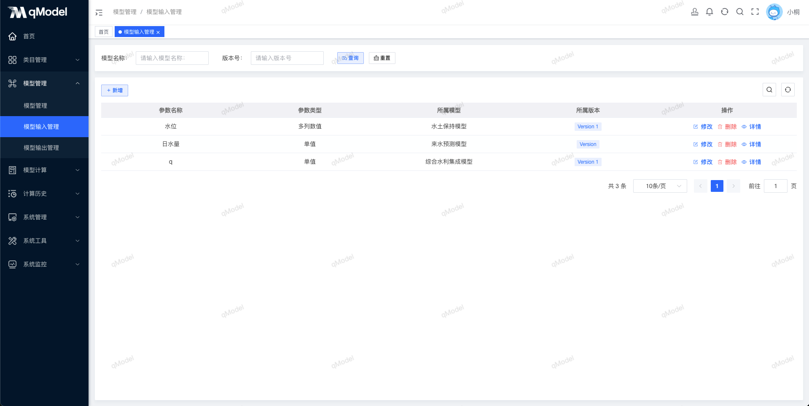
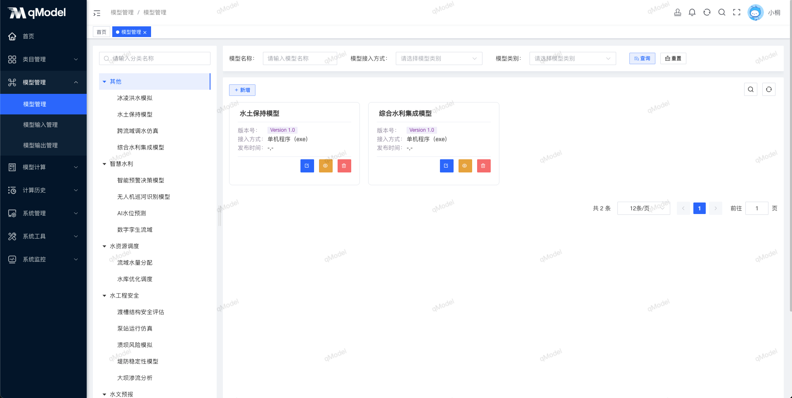
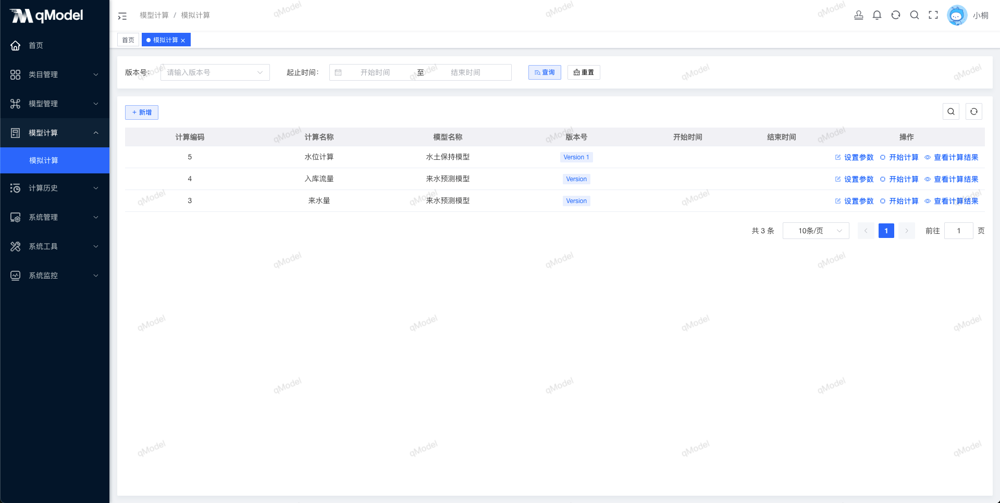

[banner.png](source/banner.png)

 
 
 
 
 
 
 

  📖简体中文 | <a href="README.en.md">📖English</a>

## 🌈平台简介

**qModel** 是一个以 **模型全生命周期管理** 为核心的开源模型平台，提供模型接入、注册、测试、部署、计算、融合、编排与服务化等能力，帮助企业与科研机构将算法资产转化为可运维、可复用、可治理的智能服务。  
平台支持 Python、Java、exe 等多语言模型格式，打通从实验到生产的工程链路，为传统算法的协同应用提供坚实底座。

[//]: # (✨✨✨**在线文档**✨✨✨ <a href="https://qmodel.qiantong.tech" target="_blank">https://qmodel.qiantong.tech</a>)

✨✨✨**演示地址**✨✨✨ <a href="https://demo.qmodel.tech" target="_blank">https://demo.qmodel.tech</a> （账号：`qModel`，密码：`qModel123`）

> **qModel模型管理平台，让模型贯穿全生命周期，让智能持续创造价值。**

## 🍱 典型应用场景

| 场景             | 说明                             |
|----------------|--------------------------------|
| **AI 模型资产化管理** | 统一纳管散落在各团队的模型，实现版本控制、分类标签与权限治理 |
| **科研成果工程化落地**  | 将实验室中的算法快速封装为可调用服务，加速成果转化      |
| **多模型融合推理**    | 支持加权融合、投票、Stacking 等策略，提升预测鲁棒性 |
| **智能工作流编排**    | 可视化拖拽构建包含多个模型的 AI 工作流，支撑复杂业务逻辑 |
| **私有模型市场建设**   | 构建企业内部模型共享与交易机制，促进知识复用与创新协作    |

## 🚀 核心优势

- 覆盖模型 **全生命周期**：从上传、测试、发布到监控、下线，全程可追溯
- **多语言兼容**，支持 Python 脚本、Java JAR、可执行程序等多种模型形态
- **轻量级架构**，开箱即用，支持 Docker 一键部署
- **模块化设计**，核心功能解耦，便于二次开发与集成
- **初生即开源**，社区共建，持续演进

## ✨ 核心功能

| 功能模块        | 描述                                         | 开源版    |
|-------------|--------------------------------------------|--------|
| **系统管理**    | 用户、角色、部门、菜单、字典、参数、公告、日志等统一治理               | ✅ 已完成  |
| **模型分类**    | 支持创建与管理模型分类体系，包括分类层级、标签分组等                 | ✅ 已完成  |
| **模型管理**    | 注册、分类、标签、审批、发布/下线、版本控制                     | ✅ 已完成  |
| **模型计算**    | 任务管理、参数配置、结果可视化、下载；开源版需手动绑定输入数据            | ✅ 已完成  |
| **计算历史**    | 查看历史计算任务记录，支持按模型、时间、状态等条件筛选与结果回溯           | ✅ 已完成  |
| **模型接入与运行** | 支持多语言模型上传、自动解析、兼容性检测；开源版支持 Python/Java/exe | ❌ 未来计划 |
| **模型封装**    | 提供标准化打包规范；提供文档指导                           | ❌ 未来计划 |
| **服务治理与调度** | 自动生成 RESTful API；支持鉴权、限流、并发控制、调用链监控、水印等    | ❌ 未来计划 |
| **综合管理**    | 开发文档管理                                     | ❌ 未来计划 |

> 注：自动化容器化、在线调试、融合编排、训练闭环等高级功能将在商业版中提供，欢迎社区共建开源版能力！

## 🛠️ 技术栈

qModel 采用前后端分离架构，后端基于 Spring Boot，前端基于 Vue 3，整合主流中间件，构建企业级模型管理解决方案。

<table>
  <tr>
    <th>技术栈</th><th>技术框架</th><th>描述</th>
  </tr>
  <tr>
    <td rowspan="6">后端技术栈</td><td>Spring Boot</td><td>主体框架，简化配置与开发</td>
  </tr>
  <tr>
    <td>MyBatis-Plus</td><td>ORM 框架，简化数据库操作</td>
  </tr>
  <tr>
    <td>Spring Security</td><td>认证授权与安全控制</td>
  </tr>
  <tr>
    <td>Quartz</td><td>定时任务调度（用于计算任务）</td>
  </tr>
  <tr>
    <td>Alibaba Druid</td><td>高性能数据库连接池</td>
  </tr>
  <tr>
    <td>Swagger</td><td>自动生成 API 文档</td>
  </tr>

  <tr>
    <td rowspan="7">前端技术栈</td><td>Vue 3</td><td>响应式前端框架</td>
  </tr>
  <tr>
    <td>Vite</td><td>极速构建工具</td>
  </tr>
  <tr>
    <td>Element Plus</td><td>现代化 UI 组件库</td>
  </tr>
  <tr>
    <td>Pinia</td><td>轻量级状态管理</td>
  </tr>
  <tr>
    <td>Vue Router</td><td>前端路由管理</td>
  </tr>
  <tr>
    <td>Axios</td><td>HTTP 请求封装</td>
  </tr>
  <tr>
    <td>ECharts</td><td>计算结果与资源监控可视化</td>
  </tr>

  <tr>
    <td rowspan="5">第三方依赖</td><td>MySQL</td><td>模型元数据存储</td>
  </tr>
  <tr>
    <td>Redis</td><td>任务队列与缓存</td>
  </tr>
  <tr>
    <td>Docker（可选）</td><td>容器化部署支持（商业版自动构建镜像）</td>
  </tr>
  <tr>
    <td>本地存储</td><td>模型文件与计算结果存储</td>
  </tr>
</table>

## 🏗️ 部署要求

在部署 qModel 之前，请确保以下环境已准备就绪：

<table>
  <tr>
    <th>环境</th><th>项目</th><th>推荐版本</th><th>说明</th>
  </tr>
  <tr>
    <td rowspan="5">后端</td><td>JDK</td><td>1.8+</td><td>运行环境</td>
  </tr>
  <tr>
    <td>Maven</td><td>3.6+</td><td>项目构建</td>
  </tr>
  <tr>
    <td>MySQL</td><td>5.7 / 8.0</td><td>元数据库</td>
  </tr>
  <tr>
    <td>Redis</td><td>5.0+</td><td>任务队列与缓存</td>
  </tr>
  <tr>
    <td>操作系统</td><td>Linux / Windows / macOS</td><td>通用支持</td>
  </tr>

  <tr>
    <td rowspan="3">前端</td><td>Node.js</td><td>16+</td><td>构建依赖</td>
  </tr>
  <tr>
    <td>pnpm / npm</td><td>最新版</td><td>包管理器</td>
  </tr>
  <tr>
    <td>Vite</td><td>≥4.0</td><td>构建工具</td>
  </tr>
</table>

## 🚨 商用授权

qModel 提供 **开源版** 与 **商业版** 双轨模式：
- **开源版** 适合学习、评估与轻量级生产，遵循 Apache 2.0 协议（可商用，保留 Logo）；
- **商业版** 面向政企客户，提供 **自动化容器化、模型融合、工作流编排、训练闭环、模型市场** 等高阶能力，并包含专属技术支持与私有仓库访问权限。

[//]: # (👉 如需 **品牌定制授权** 或 **申请商业版试用**，请访问：[💼 了解授权详情]&#40;https://qmodel.qiantong.tech/business.html&#41;)
👉 如需 **品牌定制授权** 或 **申请商业版试用**，请加入 QQ 交流群咨询

## 🚀 快速开始

[//]: # (👉 <a href="https://qmodel.qiantong.tech/discuss.html">点击查看快速部署手册</a>)
👉 <a href="./QUICKSTART.md">点击查看快速部署手册</a>

## 👥 QQ交流群

欢迎加入 qModel 官方 QQ 交流群，获取最新动态、技术答疑与使用经验分享！

[//]: # (👉 <a href="https://qmodel.qiantong.tech/discuss.html">点击加入 QQ 交流群</a>)

## 🖼️ 系统配图
<table>
    <tr>
        <td></td>
        <td></td>
    </tr>
    <tr>
        <td></td>
        <td></td>
    </tr>
    <tr>
        <td></td>
        <td></td>
    </tr>
</table>
