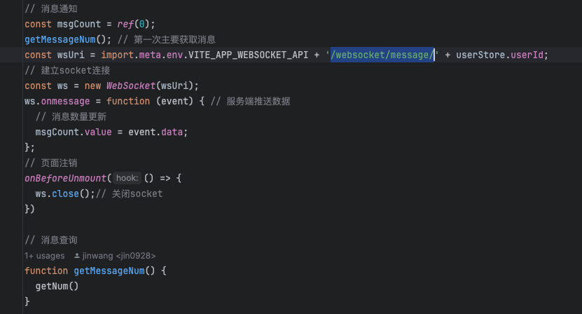

## 前端
    建立 socket 连接，连接地址为/websocket/message/当前用户 id。
    socket 可接收推送的消息数量，初始化时需主动获取消息数量。
    离开时，务必关闭 socket 连接。

## 后端
    使用方法：
        消息模版操作：在系统管理中的消息模版进行增删改查。
        消息发送：在messageService中的send方法进行发送（通过模版向某一用户发送消息）。
        消息数量查询：在messageService中的getNum。
        消息已读：在messageService中的read。
        消息批量已读：在messageService中的readAll。
    实现流程：读取指定模版生成对应的消息，添加到数据库中，添加完成后通过 websocket 通知对应的用户。
    涉及数据库
        message  消息通知
        message_template  消息模版
